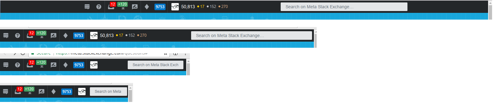
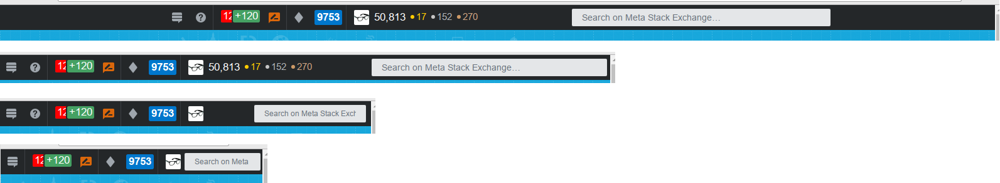

# TopBarTweaks, v0.2

### by Cody Gray ([licensed](LICENSE) under [CC BY](http://creativecommons.org/licenses/by/4.0/))

This is a user-script that applies visual and accessibility tweaks to [the new topbar for the Stack Exchange network](https://meta.stackexchange.com/questions/300829/new-top-bar-is-coming-to-the-stack-exchange-network).

The changes here are heavily inspired by the whinings of Stack Exchange network moderators, both in private conversations and in the answers to the announcement post on Meta. In particular, the accessibility complaints [raised by Monica Cellio](https://meta.stackexchange.com/a/300834).

A user-script is obviously not ideal for any number of reasons, including conditional availability, limited browser support, and decreases in rendering speed. However, it's the best we can do for now, unless and until Stack Exchange decides to heed the community's wishes and fix the problems.

### Install

 [**Normal version**](TopBarTweaks.user.js)
 
 [**LargeFonts version**](TopBarTweaks-LargeFonts.user.js)

### Features

 - **Prevents clipping of topbar's edges on small viewports**
 
    When using small screens, items on the right-hand side of the topbar get hidden. In small browser windows, the content is covered up by the window's scroll bar. This script makes some changes that should limit the width of the topbar and/or introduce padding to prevent the clipping of these items.
    
    But, it also solves the problem a different way by...
    
 - **Ensures that critical information is on the left side or center of the topbar**
 
    This script moves all of the most critical information that the topbar provides (notifications and moderator tools) back to the left-hand side or center of the topbar, instead of the right-hand side, where it risks being either overlooked or clipped off altogether.
    
    It also retains the site-switcher icon from the new topbar design, but moves it back to the fixed, left-most position where the old "Stack Exchange" logo multi-collider super-dropdown used to be found. The redundant, static "Stack Exchange" logo is hidden altogether.
    
    On *very* small screens, such as would be found on a mobile device, the drop-down menus invoked by certain icons in the topbar always display flush with the left-hand side of the window, instead of being aligned with the invoking icon. This should hopefully minimize clipping of critical information on these configurations.
    
 - **Adds the "help" icon back to the topbar**
 
    The official design removes the "help" icon for moderators, showing it only to new and low-rep users. I think this is inconvenient, because I actually *use* the help icon to navigate to these pages quickly, even (*especially*) as a moderator, where I'm constantly linking to them. Since the Stack Exchange-version of the topbar doesn't have site-specific navigation crammed into it like the Stack Overflow version, there's enough room in it for the help icon to be displayed, so this script puts it back.
    
    (Unless you're viewing on a *very* small screen, such as a mobile device; then, the help icon is still omitted for space considerations.)
    
 - **Puts search box back on the right side of the topbar**
 
    Since critical information has been moved to the left side or center of the topbar, that leaves the search box over on the right-hand side, where it used to be in the old design. This ensures it's still highly visible, but recognizes its naturally lower priority.
    
 - **Decreases vertical height of the search box**
 
    The height of the search box in the topbar has been slightly decreased to make it less imposing and improve its visual consistency with other topbar elements.
    
 - **Limits the amount of cheese movement that occurs when switching between sites where you have different privilege levels**
 
    This script (re-)arranges items in the topbar with an eye towards minimizing the amount of movement that occurs as you switch back and forth between sites where you have different amounts of reputation and/or moderation privileges. Items that are *always* available are on the far left, while items that are *conditionally* available are further towards the right.
    
    Not coincidentally, this results in a layout that is rather similar to the old topbar design.
    
    This should work *almost* perfectly&mdash;the only thing that will move is the user gravatar/reputation, and that's mostly because it requires too much CSS- and JS-fu to prevent it.
    
 - **Adds `href` links to certain notification icons**
 
    This one's a little complicated, but can pretty much be ignored except by experts.
    
    The script adds `href` links to the corresponding raw HTML pages for several of the notification icons on the topbar, including "inbox", "achievements", and the moderator inbox. This allows you to right-click or <kbd>Ctrl</kbd>+click to open these pages in a new tab. The page that you'll see contains exactly the same information as you would see in the drop-down menu for that icon, except it's completely unstyled. (*TODO: Future versions of the user script might add styles to slightly improve the readability of these pages.*)

     This change has absolutely no effect on what happens when you click normally on one of these icons in the topbar. The "review" icon already has something like this attached to it. If you don't make a habit of opening links in new tabs, you probably won't even notice the change.
     
 - **Adds more quick-links to the moderator drop-down menu**
 
     Obviously this one's moderator-only folks...
     
     The script customizes the moderator inbox drop-down menu to add quick links to some commonly-accessed pages: links, history, and flags.
     
     The latest official design of the topbar *does* add a link here to the "history" dashboard, but that page is quite slow to load and wastes time when you just want to navigate immediately to one of the other tabs.

 - **Increases the font size for textual items in the topbar**
 
     The script includes custom style tweaks that increase the font size on numerical notification badges displayed in the topbar, including the inbox, achievements, moderator flags, and your reputation/badges. The text in the official design is just a wee bit too small to be comfortable.
     
     The moderator flag count is made bold, just to make it stand out a bit more than your lowly vanity notifications.
     
     There is also a version of this script ("LargeFonts") that cranks the fonts up even bigger for users with aging eyes or other visual impairments.
     
 - **Implements other visual tweaks suggested by community members**

     Some of these are arguably bugs that should/may be fixed by the Stack Exchange team in the official version, but unless and until that happens...
 
     - [Properly aligns the "count" badges in the notification icons](https://meta.stackexchange.com/a/301065) so that they appear positioned in the upper-right corner of the corresponding icon, rather than covering up the icon. Since the Stack Exchange version of the topbar is slightly shorter than the Stack Overflow version, the "raise-on-hover" effect was changed to work in reverse: when you hover over the icon in the topbar, the count badge slides *down* to cover the icon.
     - [Remove the border and shadow on the search box's button](https://meta.stackexchange.com/a/301034).
     
         (Note that when you are using the "LargeFonts" version, the text is too big for this to work, so the count badge *does* just get positioned smack-dab over the top of the corresponding icon. You wouldn't be able to see any meaningful parts of the icon peeking through anyway. The "raise-on-hover" effect is still used for "LargeFonts"&mdash;i.e., it is not reversed to "lower-on-hover".)

### Notes

 - This works *only* on the Stack Exchange version of the topbar. It does not work on the Stack Overflow (and Meta Stack Overflow) version. The user script knows enough not to enable itself on SO/MSO.
 - Moderator-only tweaks *should* simply be inactive on sites where you don't have moderator privileges, but there may be bugs. :-)
 - If you want to make the topbar "sticky" so that it remains fixed at the top of the viewport as you scroll down the page, you can do so by adding uncommenting the `position` style under the `.top-bar` style definition (see [TopBarTweaks.css](TopBarTweaks.css)).
 - If you want to make things bold for even greater visibility, especially in the "LargeFonts" version, it's as simple as adding a `font-weight: bold;` style to the corresponding CSS.

### Gallery

**Normal; moderator privileges:**

*From top-to-bottom: full-size viewport, medium-size viewport, small viewport, minimal viewport*

**LargeFonts; moderator privileges:**

*From top-to-bottom: full-size viewport, medium-size viewport, small viewport, minimal viewport*

If you don't have moderator privileges, the moderator diamond and flag count will simply not be visible. I obviously don't have moderator privileges on MSE, so the screenshots were taken using HTML ripped directly from Stack Overflow's moderator displays.

### Bugs/ToDo

 - "LargeFonts" version might be a bit too big if you get a lot of notifications like I do (see screenshot above). It works fine for lots of moderator flags, though, so mods on busy sites are set!
 - Provide a better interface for configurable options than having to edit the CSS and JS code files directly.
 - Tweaking the appearance of the topbar (*i.e.*, icon and background color) so its appearance is consistent across Stack Overflow and all of the other Stack Exchange sites.
 - Testing the "sticky" option to see if it actually works well in edge cases. (I don't use thisfeature &mdash;in fact, I hate it&mdash;so I won't be testing or tweaking this myself.)
